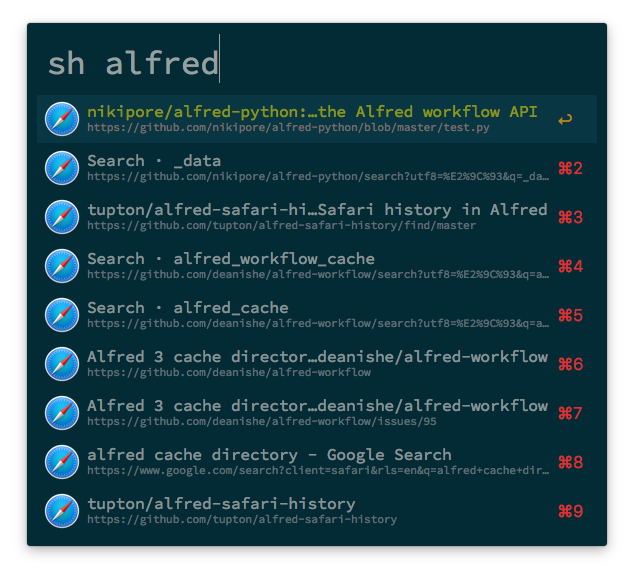

# Alfred Safari History Workflow

Access your Safari history from Alfred with `sh {query}`.

## How to install

[Download the workflow from the releases page][releases] and install by double-clicking it.

  [releases]: https://github.com/tupton/alfred-safari-history/releases

Safari's History database is used by this workflow to access browser history. In order to read this database, Alfred must have Full Disk Access permissions. This is possible to do in System Preferences > Security & Privacy > Privacy. Currently, there are no more granular permissions than Full Disk Access to allow apps to read the Safari History database.

### From source

Clone this repo and symlink it to `<sync directory>/Alfred.alfredpreferences/workflows/alfred-safari-history`. Your Alfred sync directory can be found going to Preferences → Advanced → Syncing.

Then run `make dev` to install requirements and set the repository up to be used as a workflow.

## Configuration

The workflow should work out of the box with the `sh` prefix. If you'd like to change this, update the keyword in the Alfred workflow's script filter.

The Alfred script filter is set up to use the default Safari profile. If you need to use a different profile, update the `PROFILE` environment variable in the Alfred workflow's script filter.

## How to build

`make workflow` will put any dependencies in place and build `alfred-safari-history.alfredworkflow` in the current directory.

Note that `sitepackages.py` attempts to find `alfred.py` and copy it into the workflow archive. Please let me know if this script fails to find `alfred.py`. It attempts to find it in both global installations and within a virtualenv, but I have only tested this on my local machine.

`make dev` also puts dependencies in place so that the workflow can work when symlinked to the correct workflows directory as mentioned above.

## Thanks

This workflow uses the wonderful [alfred-python][ap] library. It is provided in the generated workflow and does not need to be installed globally or otherwise before using this workflow.

  [ap]: https://github.com/nikipore/alfred-python
